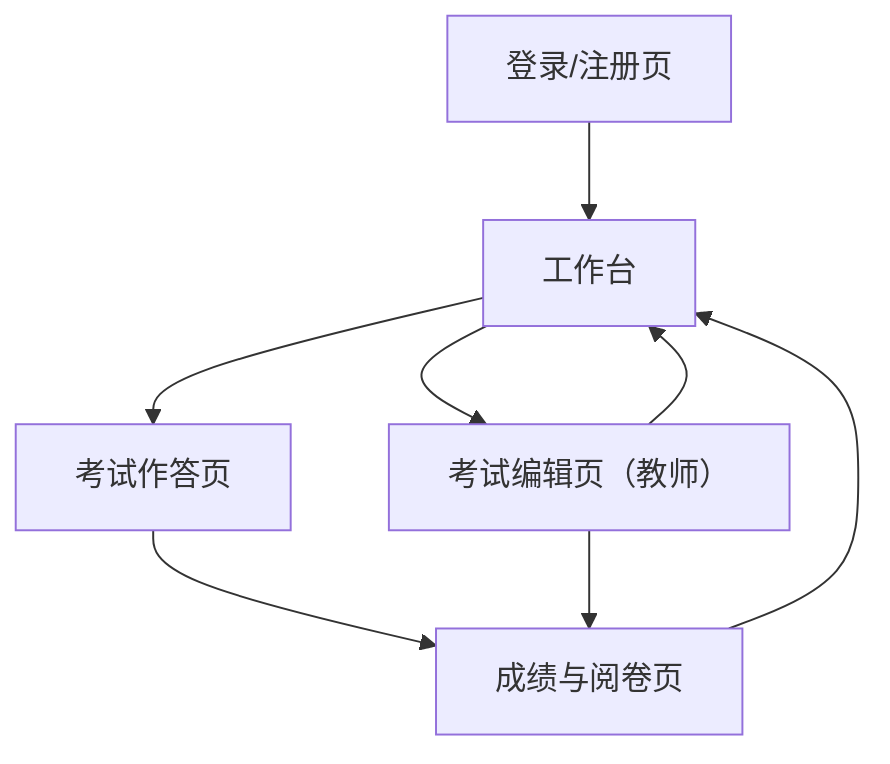

## 1. Product Overview
面向学校/培训机构的网页端在线考试系统，支持教师创建并发布考试、学生在线作答与查看成绩。
通过统一题库、考试发布与阅卷流程，降低组织考试与统计成绩成本。

## 2. Core Features

### 2.1 User Roles
| 角色 | 注册/加入方式 | 核心权限 |
|------|---------------|----------|
| 学生 | 账号注册或由教师导入后激活 | 参加被分配的考试；提交答卷；查看本人考试成绩与答题明细 |
| 教师 | 账号注册 + 管理员/组织审核（可配置为免审核） | 创建/编辑题目与考试；发布/撤回考试；查看与阅卷学生答卷；发布成绩 |

### 2.2 Feature Module
系统最小可用版本包含以下页面：
1. **登录/注册页**：账号登录、注册、找回密码。
2. **工作台（按角色展示）**：学生考试列表与状态；教师考试管理入口与统计。
3. **考试作答页**：考试说明、计时、答题、交卷。
4. **考试编辑页（教师）**：创建考试、配置规则、组卷与题目管理、发布。
5. **成绩与阅卷页**：教师阅卷/发布成绩；学生查看成绩与解析（如有）。

### 2.3 Page Details
| Page Name | Module Name | Feature description |
|-----------|-------------|---------------------|
| 登录/注册页 | 认证 | 登录/注册/退出；支持重置密码；首次登录完成角色确认（学生/教师） |
| 工作台（学生） | 考试列表 | 查看待考/进行中/已交卷/已出分列表；按课程/班级筛选；进入考试详情并开始作答 |
| 工作台（教师） | 考试管理概览 | 查看本人考试列表（草稿/已发布/已结束）；查看参与人数与提交进度；进入编辑或阅卷 |
| 考试作答页 | 考试规则与计时 | 展示考试名称、时长、开始/结束时间；倒计时；自动保存答题进度（最小：本地/在线其一） |
| 考试作答页 | 答题与交卷 | 单选/多选/判断/填空/简答（可按你实际范围裁剪）；题目导航；提交答卷并二次确认 |
| 考试编辑页（教师） | 基本信息 | 填写考试标题、说明、时长、开考/截止时间、允许次数、是否乱序等基础配置 |
| 考试编辑页（教师） | 组卷与题目管理 | 从题库选题或新建题目；配置分值；预览试卷；保存草稿 |
| 考试编辑页（教师） | 发布与分配 | 选择发布范围（班级/学生）；发布/撤回；生成考试入口（如链接/码） |
| 成绩与阅卷页（教师） | 阅卷 | 自动判分客观题；对主观题逐题给分与评语；保存阅卷进度 |
| 成绩与阅卷页（教师） | 成绩发布 | 汇总总分与题目得分；一键发布/撤回成绩；导出成绩（CSV） |
| 成绩与阅卷页（学生） | 成绩查看 | 查看本人总分、各题得分与作答；显示发布状态（未出分/已出分） |

## 3. Core Process
**学生流程**：登录 → 在工作台查看“待考” → 进入考试并开始 → 计时答题（过程保存）→ 交卷 → 等待出分 → 在成绩页查看总分与明细。

**教师流程**：登录 → 进入考试编辑页创建考试（配置规则、组卷）→ 分配到班级/学生并发布 → 监控提交进度 → 阅卷（主观题给分）→ 发布成绩 → 导出成绩。

**权限边界（关键约束）**：
- 学生仅能看到“分配给自己且已发布”的考试；仅能读取/修改“自己的答卷与答案”。
- 教师仅能管理“自己创建的题目与考试”；仅能查看/阅卷“自己考试的学生答卷”。
- 成绩未发布前，学生只能看到“已交卷/待出分”状态，不得读取评分细节（可配置）。

