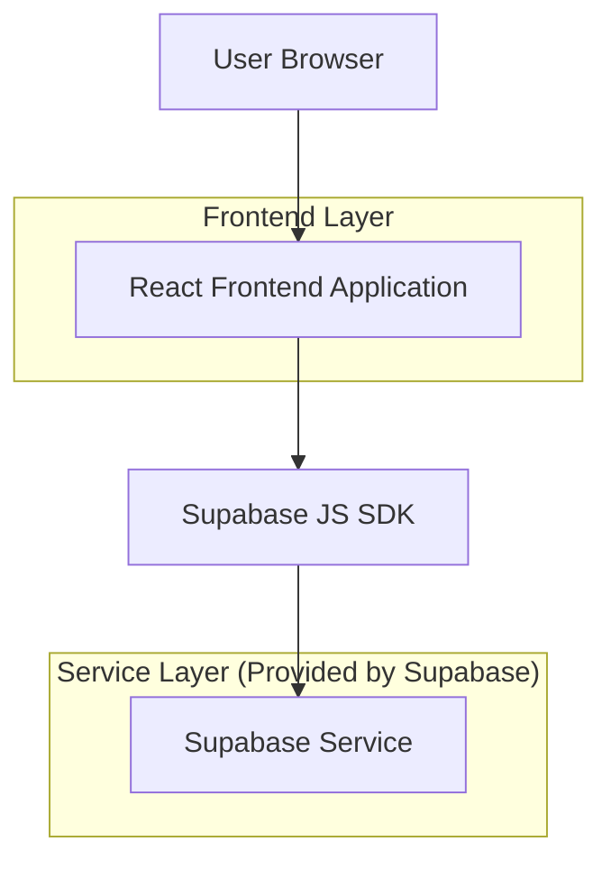
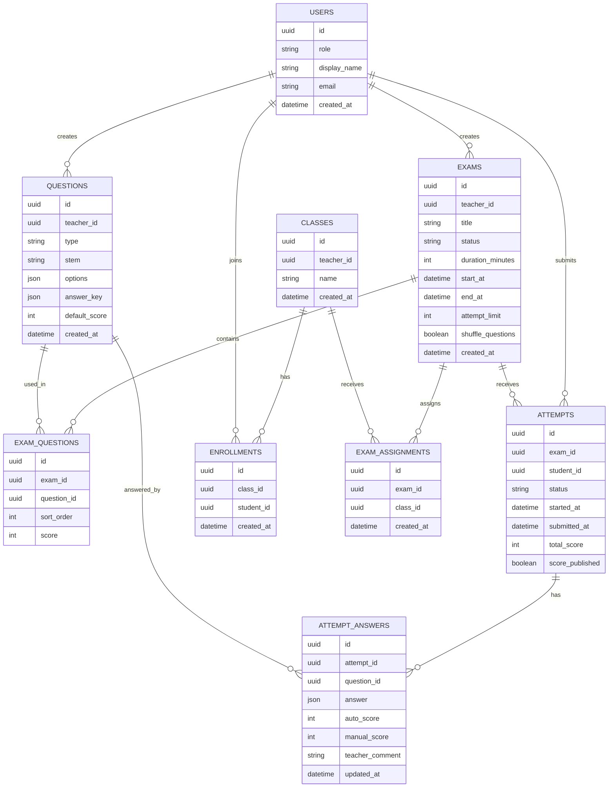

## 1.Architecture design


## 2.Technology Description
- Frontend: React@18 + TypeScript + vite + tailwindcss@3
- Backend: Supabase（Auth + Postgres + Storage）

## 3.Route definitions
| Route | Purpose |
|-------|---------|
| /login | 登录/注册/找回密码 |
| / | 工作台（按角色：学生/教师） |
| /exams/:examId | 考试详情与进入入口（开始考试） |
| /attempts/:attemptId | 考试作答（计时、答题、交卷） |
| /teacher/exams/new | 创建考试 |
| /teacher/exams/:examId/edit | 编辑考试/组卷/发布 |
| /teacher/exams/:examId/grading | 阅卷与成绩发布 |
| /results | 学生成绩列表与详情 |

## 6.Data model(if applicable)

### 6.1 Data model definition


### 6.2 Data Definition Language
> 说明：为便于早期迭代，以下采用“逻辑外键”（不强制物理 FK），通过 RLS + 应用校验保证一致性。

**1) 用户扩展表（profiles）**（Auth 用户在 `auth.users`）
```
CREATE TABLE profiles (
  id UUID PRIMARY KEY,
  role VARCHAR(20) NOT NULL CHECK (role IN ('student','teacher')),
  display_name VARCHAR(80) NOT NULL,
  created_at TIMESTAMPTZ DEFAULT NOW()
);

GRANT SELECT ON profiles TO anon;
GRANT ALL PRIVILEGES ON profiles TO authenticated;
```

**2) 班级/加入关系**
```
CREATE TABLE classes (
  id UUID PRIMARY KEY DEFAULT gen_random_uuid(),
  teacher_id UUID NOT NULL,
  name VARCHAR(120) NOT NULL,
  created_at TIMESTAMPTZ DEFAULT NOW()
);

CREATE TABLE enrollments (
  id UUID PRIMARY KEY DEFAULT gen_random_uuid(),
  class_id UUID NOT NULL,
  student_id UUID NOT NULL,
  created_at TIMESTAMPTZ DEFAULT NOW()
);

GRANT SELECT ON classes, enrollments TO anon;
GRANT ALL PRIVILEGES ON classes, enrollments TO authenticated;
```

**3) 题库与考试**
```
CREATE TABLE questions (
  id UUID PRIMARY KEY DEFAULT gen_random_uuid(),
  teacher_id UUID NOT NULL,
  type VARCHAR(20) NOT NULL,
  stem TEXT NOT NULL,
  options JSONB,
  answer_key JSONB,
  default_score INT DEFAULT 1,
  created_at TIMESTAMPTZ DEFAULT NOW()
);

CREATE TABLE exams (
  id UUID PRIMARY KEY DEFAULT gen_random_uuid(),
  teacher_id UUID NOT NULL,
  title VARCHAR(200) NOT NULL,
  status VARCHAR(20) NOT NULL CHECK (status IN ('draft','published','closed')),
  duration_minutes INT NOT NULL,
  start_at TIMESTAMPTZ,
  end_at TIMESTAMPTZ,
  attempt_limit INT DEFAULT 1,
  shuffle_questions BOOLEAN DEFAULT FALSE,
  created_at TIMESTAMPTZ DEFAULT NOW()
);

CREATE TABLE exam_questions (
  id UUID PRIMARY KEY DEFAULT gen_random_uuid(),
  exam_id UUID NOT NULL,
  question_id UUID NOT NULL,
  sort_order INT NOT NULL,
  score INT NOT NULL
);

CREATE TABLE exam_assignments (
  id UUID PRIMARY KEY DEFAULT gen_random_uuid(),
  exam_id UUID NOT NULL,
  class_id UUID NOT NULL,
  created_at TIMESTAMPTZ DEFAULT NOW()
);

GRANT SELECT ON questions, exams, exam_questions, exam_assignments TO anon;
GRANT ALL PRIVILEGES ON questions, exams, exam_questions, exam_assignments TO authenticated;
```

**4) 作答/答案/评分**
```
CREATE TABLE attempts (
  id UUID PRIMARY KEY DEFAULT gen_random_uuid(),
  exam_id UUID NOT NULL,
  student_id UUID NOT NULL,
  status VARCHAR(20) NOT NULL CHECK (status IN ('in_progress','submitted','graded')),
  started_at TIMESTAMPTZ DEFAULT NOW(),
  submitted_at TIMESTAMPTZ,
  total_score INT DEFAULT 0,
  score_published BOOLEAN DEFAULT FALSE
);

CREATE TABLE attempt_answers (
  id UUID PRIMARY KEY DEFAULT gen_random_uuid(),
  attempt_id UUID NOT NULL,
  question_id UUID NOT NULL,
  answer JSONB,
  auto_score INT DEFAULT 0,
  manual_score INT DEFAULT 0,
  teacher_comment TEXT,
  updated_at TIMESTAMPTZ DEFAULT NOW()
);

GRANT SELECT ON attempts, attempt_answers TO anon;
GRANT ALL PRIVILEGES ON attempts, attempt_answers TO authenticated;
```

**权限边界（建议用 Supabase RLS 实现）**
- profiles：用户仅可更新自己的 `display_name`；仅可读取必要公开字段。
- exams/questions：仅 `teacher_id = auth.uid()` 可写；学生仅可读 `status='published'` 且自己所属班级被分配的考试。
- attempts：学生仅可 `INSERT/UPDATE/SELECT` 自己的 attempts；教师仅可 `SELECT` 自己考试的 attempts。
- attempt_answers：学生仅可写自己的答案；教师仅可对其考试的答案填写 `manual_score/teacher_comment`；学生在 `score_published=true` 前不可读评分字段（可拆表或用视图/列级策略实现）。

> 注：若你需要“考试链接/码可公开访问”，建议仍要求登录后再开始作答，以便绑定 student_id 并启用 RLS。